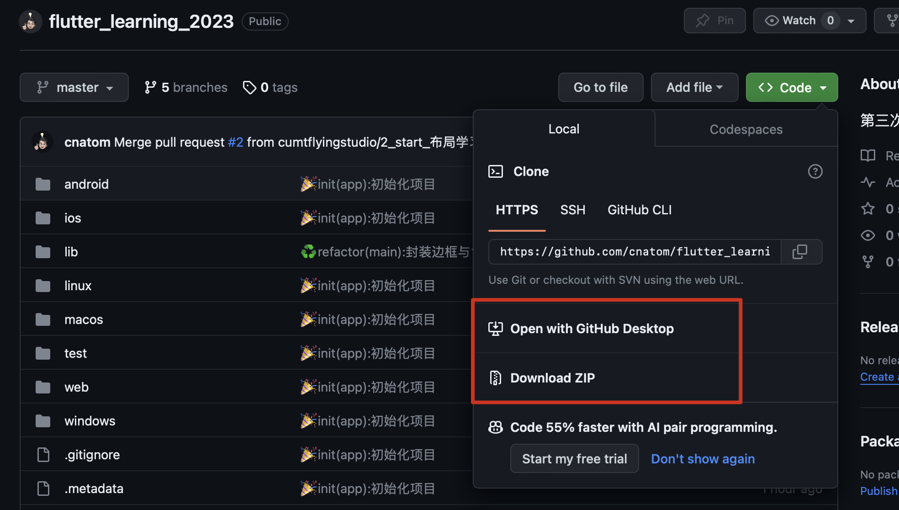
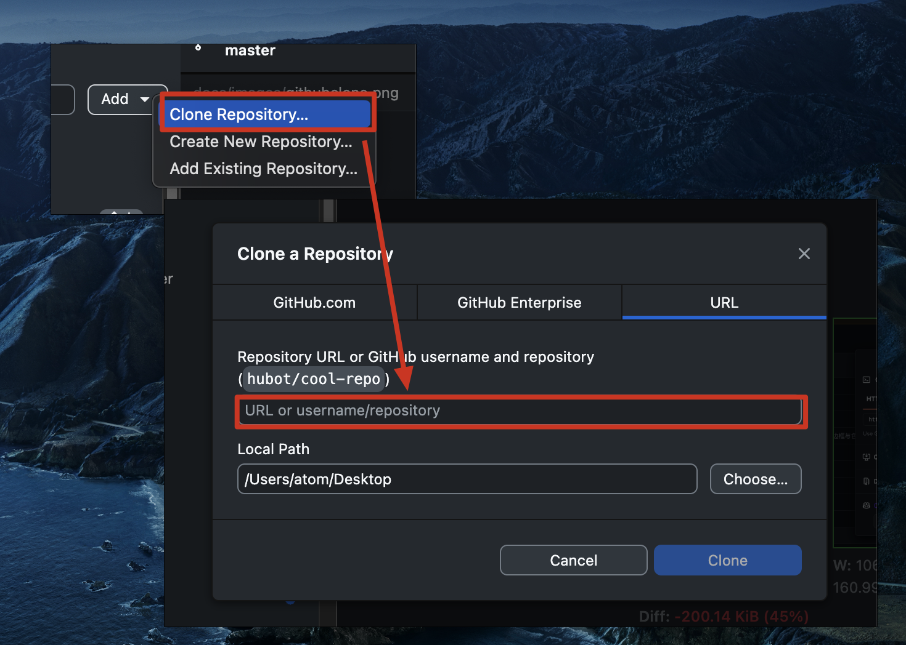
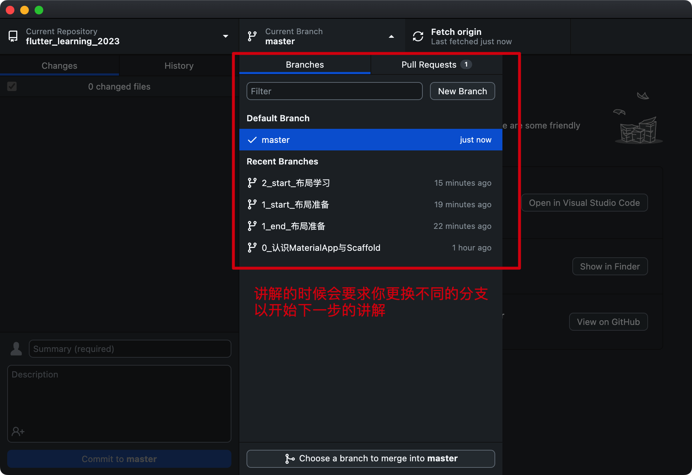
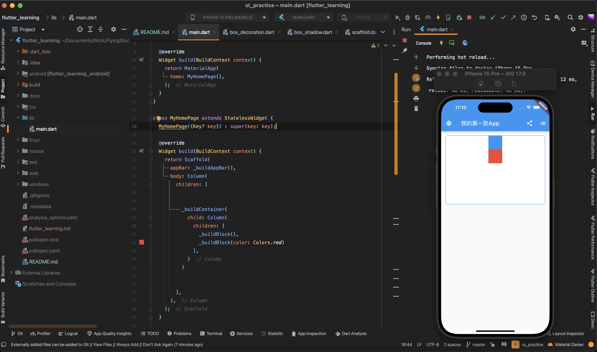

# 翔工作室客户端UI培训项目

> 本项目是面向计算机初学者的`Flutter`培训课程项目

## 培训前你需要做的事情

1. 安装`Github Desktop`： [https://desktop.github.com/](https://desktop.github.com/)
2. 如下图所示，将本项目的URL复制下来。

3. 在`Github Desktop`中clone这个仓库。

4. 然后就可以愉快的根据进度切换分支啦！

5. 使用`Android Studio`打开本项目，打开后一般会提示`Pubspec has been edited`，点击右边的按钮`Get dependencies`即可，最后打开`Android`模拟器并运行该项目如下图所示。

