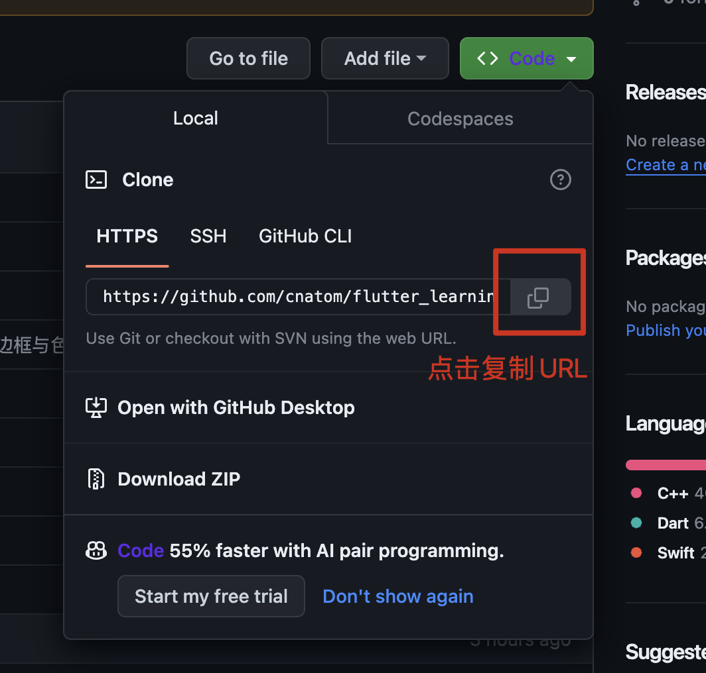

# 翔工作室客户端UI培训项目

> 本项目是面向计算机初学者的`Flutter`培训课程项目

## 培训前你需要做的事情

1. 安装`Github Desktop`： [https://desktop.github.com/](https://desktop.github.com/)
2. 如下图所示，将本项目通过`Github Desktop`打开或者直接下载压缩包

3. 在`Github Desktop`中打开这个项目，如下图所示

4. 使用`Android Studio`打开本项目，打开`Android`模拟器并运行该项目，如下图所示

